# DevOps Haven

```
   ___                     ___     _ __                    _  _
  |   \    ___    __ __   / _ \   | '_ \   ___      o O O | || |   __ _    __ __    ___    _ _
  | |) |  / -_)   \ V /  | (_) |  | .__/  (_-<     o      | __ |  / _` |   \ V /   / -_)  | ' \
  |___/   \___|   _\_/_   \___/   |_|__   /__/_   TS__[O] |_||_|  \__,_|   _\_/_   \___|  |_||_|
_|"""""|_|"""""|_|"""""|_|"""""|_|"""""|_|"""""| {======|_|"""""|_|"""""|_|"""""|_|"""""|_|"""""|
```

Centralized hub for my DevOps wisdom – a curated collection of scripts, guides, and best practices to streamline development and operations. Your go-to resource for mastering the art of seamless software delivery. 😎🚀

# State of the project

| Subject                                                                   | Code | DONE |
| :------------------------------------------------------------------------ | :--: | :--: |
| Enriched web application with automated tests                             | APP  |  ✔   |
| Continuous Integration and Continuous Delivery (and Deployment)           | CICD |  ✔   |
| Infrastructure as code using Ansible                                      | IAC  |  ✔   |
| Containerisation with Docker                                              |  D   |  ✔   |
| Orchestration with Docker Compose                                         |  DC  |  ✔   |
| Orchestration with Kubernetes                                             | KUB  |  ✔   |
| Service mesh using Istio                                                  | IST  |  ✔   |
| Monitoring                                                                | MON  |  ✔   |
| Accurate project documentation in README.md file                          | DOC  |  ✔   |
| CI job for automated build and publish to DockerHub of the USER API image | CICD |  ✔   |
| Automated K8S deployments with Helm for variabilisation                   | K8S  |  ✔   |
| Implementation of new API methods (Update, Delete, Get all keys)          | APP  |  ✔   |
| Improved tests and new tests for every new API method                     | CICD |  ✔   |
| API documentation using Swagger UI                                        | APP  |  ✔   |
| API health endpoint                                                       | APP  |  ✔   |
| Complete DevOps toolbox                                                   |      |  ✔   |
| Ready to use DevOps Infrastructures                                       | INF  |  ✔   |

# Summary

0. [Prerequisites](#prerequisites)
1. [USER API](#user-api)
   1. [Installation](#installation)
   2. [Usage](#usage)
   3. [Testing](#testing)
   4. [Documentation](#documentation)
2. [CI/CD Pipeline](#cicd-pipeline)
   1. [CI](#ci)
   1. [CD](#cd)
3. [Infrastructure as a Code](#infrastructure-as-a-code)
   1. [Allocating VM](#allocating-vm)
   2. [provisioning VM with Ansible](#provisioning-vm-with-ansible)
   3. [Running app in Vagrant VM](#running-app-in-vagrant-vm)
4. [Docker Image](#docker-image)
   1. [Building the image](#building-the-image)
   2. [Publishing the image](#publishing-the-image)
   3. [Automation pipeline](#automation-pipeline)
   4. [Running the image](#running-the-image)
5. [Docker Compose](#docker-compose)
6. [Orchestration with K8S](#orchestration-with-k8s)
   1. [PV and PVC](#pv-and-pvc)
   2. [Services](#services)
   3. [Pods and Deployment](#pods-and-deployement)
   4. [Running app in K8S](#running-app-in-k8s)
7. [Istio in K8S](#istio-in-k8s)
   1. [Deploy NodeJS app with istio](#deploy-nodejs-app-with-istio)
   2. [Deploy addons in K8S cluster](#deploy-addons-in-k8s-cluster)
      1. [Service Mesh](#service-mesh)
      2. [Monitoring](#monitoring)
   3. [Limitations](#limitations)
8. [Helm Integration](#helm-integration)
   1. [Why Helm?](#why-helm)
   2. [Implementation](#implementation)
9. [Bonuses](#bonuses)
   1. [Global Bonuses](#bonuses)
   2. [DevOps Toolbox](#toolbox)
10. [Useful Links](#useful-links)
11. [Authors](#authors)

# Prerequisites

For running this project you'll need the following software/apps to be installed on your device.

- [Git](https://git-scm.com/)
- [NodeJS](https://nodejs.org/en)
- [npm](https://www.npmjs.com/)
- [Redis](https://redis.io/)
- [Vagrant](https://www.vagrantup.com/)
- [VirtualBox](https://www.virtualbox.org/)
- [Docker](https://www.docker.com/)
- [Docker Compose](https://docs.docker.com/compose/)
- [Minikube](https://minikube.sigs.k8s.io/docs/start/)
- [kubectl](https://kubernetes.io/docs/tasks/tools/)
- [Helm](https://helm.sh/)

Find in the [Useful Links](#useful-links) part, the docs and installation processes of these software.

This project has been designed to run on a Linux machine. Most of the steps will still work on a Windows machine, but you may encounter problems with scripting and VM management. These problems are not due to the project itself but to the execution environment, which we don't control.

# USER API

It is a basic NodeJS web application exposing REST API that creates and stores user parameters in [Redis database](https://redis.io/). This application allows the USER to perform CRUD operations.

The source code of the application is available at [Source Code](./userapi/src/)

## Installation

This application is written on NodeJS and it uses Redis database. Follow the instructions below to perform the complete installation of this application.

1. [Install NodeJS](https://nodejs.org/en/download/)

2. [Install Redis](https://redis.io/download)

3. Clone our repo to your computer:

```bash
git clone https://github.com/tristanqtn/ece-devops-ING4-SI-03/
```

4. Navigate to the freshly downloaded repo:

```bash
cd ece-devops-ING4-SI-03
cd userapi
```

5. Since node modules are not present in this repo you should install them manually using the following command:

```bash
npm install
```

If you've followed the instructions above, the entire project is installed on your machine and you have the tools (NodeJS and Redis) to run this application locally. The type of installation you've just performed is comparable to a dev-type installation.

Furthermore, the aim of this project is to deploy this same application in a variety of environments, so in the rest of this documentation you'll learn how to deploy the application using different methods.

## Usage

Here few explanations concerning the usage of the application in local mode. This type of deployment requires that Redis and NodeJS are already installed on the hosting device. Redis must be running when you use the application. To make sure Redis is running use the command `redis-cli PING` and Redis should answer with `PONG`.

Start a web server: in the `./userapi` folder run the following command to launch the application.

```bash
npm start
```

For dev mode:

```bash
npm run dev
```

It will start a web server available in your browser at `http://localhost:3000`.

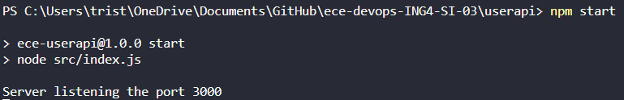

Now the application is running on your device and you should be able to access the application home page at [USER API - home](http://localhost:3000). This home page explains you how to use the whole application.

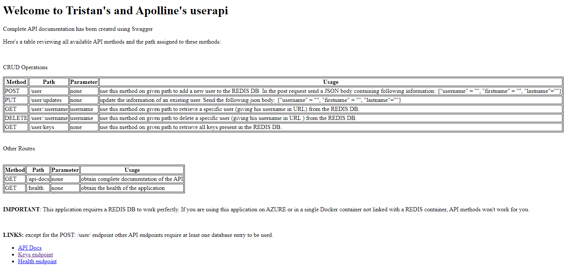

Here's a list of operations available using the REST API. For API testing we strongly recommend to use [Postman](https://www.postman.com/).

1. **Create a user**

This method will allow you to insert a new user in the Redis DB. Send a POST (REST protocol) request using the following command:

```bash
curl --header "Content-Type: application/json" \
  --request POST \
  --data '{"username":"tristanqtn","firstname":"tristan","lastname":"querton"}' \
  http://localhost:3000/user
```

Or using Postman, send a POST request to `http://localhost:3000/user` with the following `json` body:

```json
{
  "username": "tristanqtn",
  "firstname": "tristan",
  "lastname": "querton"
}
```

The API should respond you with the following `json` message:

```json
{ "status": "success", "msg": "OK" }
```

2. **Retrieve the information of a specific user**

This method will allow you to retrieve the `firstname` and `lastname` of a user inserted in Redis using its `username`. To do so send a GET request to the API at `http://localhost:3000/user/:username` where `username` is the username of the user you want to get the information.

Use the following bash command to send the GET request:

```bash
curl http://localhost:3000/user/:username
```

Or using Postman, send a GET request to `http://localhost:3000/user/:username` with the correct `username` parameter.

The API should respond you with the following `json` message:

```json
{
  "status": "success",
  "msg": {
    "firstname": "tristan",
    "lastname": "querton"
  }
}
```

3. **Retrieve all keys in the Redis database**

This method will allow you to retrieve all keys stored in Redis. To do so send a GET request to the API at `http://localhost:3000/user/keys`.

Use the following bash command to send the GET request:

```bash
curl http://localhost:3000/user/keys
```

Or using Postman, send a GET request to `http://localhost:3000/user/keys`.

The API should respond you with the following `json` message:

```json
{
  "status": "success",
  "msg": ["tristan", "apolline"]
}
```

4. **Update the information of a specific user**

This method will allow you to update the information of an already inserted uder the Redis DB. Make sure to use the `username` of a user existing in the DB. Send a PUT (REST protocol) request using the following command:

```bash
curl --header "Content-Type: application/json" \
  --request PUT \
  --data '{"username":"tristanqtn","firstname":"tristan","lastname":"querton"}' \
  http://localhost:3000/user
```

Or using Postman, send a PUT request to `http://localhost:3000/user` with the following `json` body:

```json
{
  "username": "tristanqtn",
  "firstname": "tristan",
  "lastname": "querton"
}
```

The API should respond you with the following `json` message:

```json
{ "status": "success", "msg": "OK" }
```

5. **Delete a specific user**

This method will allow you to delete a user inserted in Redis using its `username`. To do so send a DELETE request to the API at `http://localhost:3000/user/:username` where `username` is the username of the user you want to delete.

Use the following bash command to send the GET request:

```bash
curl -X DELETE http://localhost:3000/user/:username
```

Or using Postman, send a DELETE request to `http://localhost:3000/user/:username` with the correct `username` parameter.

The API should respond you with the following `json` message:

```json
{
  "status": "success",
  "msg": 1
}
```

6. **Health Endpoint**

An API endpoint has been created to send the current health state of the application. Send a GET request to the `http://localhost:3000/health` (or curl it with `curl http://localhost:3000/health`) and the API should respond you with a message similar to the following one:

```json
{ "uptime": 389.8366598, "status": "OK", "timestamp": 1700817327148 }
```

## Testing

This application has been covered with tests. These tests will be useful for creating CI/CD pipelines. They are also useful for checking the integrity of the application after code has been added or modifications have been made. To run these tests make sure Redis is running with the command `redis-cli PING` and Redis should answer with `PONG`. Then run the following command that will automatically start the server and then perform the suite of tests.

```bash
npm run test
```

The code of the test scripts is available at [Tests](./userapi/test/)

Here's a list of all test that will be performed:

```
  Configure
    - load default json configuration file
    - load custom configuration

  Redis
    - should connect to Redis

  User
    Create
      - create a new user
      - passing wrong user parameters
      - avoid creating an existing user
    Get
      - get a user by username
      - can not get a user when it does not exist
    Get keys
      - get the key of an existing user
    Delete
      - delete an existing user
      - prevent deleting a non-existing user

  User REST API
    POST /user
      - create a new user
      - pass wrong parameters
    GET /user
      - get an existing user
      - can not get a user when it does not exist
    GET /user/keys
      - get the key of an existing user
    Delete /user
      - delete an existing user
      - can not delete a user when it does not exist
    PUT /user
      - update an existing
      - pass wrong parameters
      - can not delete a user when it does not exist
```

The expected output of the execution of all test script is the following screenshot:

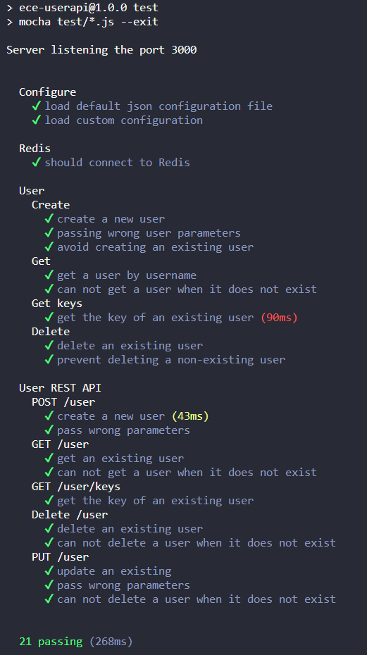

If you don't have Redis installed and you can't install it, don't worry we've created a [Docker Compose file](./tools/standalone_redis/docker-compose.yaml). Run the `docker compose up` command in the given folder `./tools/standalone_redis/`, this will start a standalone Redis server with the correct port mapping.

## Documentation

A Swagger generator has been added to the API. The API description is available at [API Docs](http://localhost:3000/api-docs)

# CI/CD Pipeline

Using GitHub actions we have created a CI/CD pipeline. This pipeline is running on every push or accepted pull request. This pipeline is made out of two jobs. One ensures the Continuous Integration part and the other the Continuous Deployment. We could have perform those two jobs within a single job but it's part of the best practices to at least split the integration and the deployment.

The code of this CI/CD pipeline is available at [CI/CD](./.github/workflows/ci_cd_userapi.yml)

CI/CD Pipelines are not executed locally but on a GitHub server similar to a production environment. Thus, for each job we need to tell the server which dependencies are required. We run those pipelines on a clean remote server because we want to reproduce a production environment.

## CI

CI stands for Continuous Integration. This job is responsible of making sur that the added code (pushed or merged) is integrating correctly with the legacy code. Verification of correct integration is carried out by some [tests](./userapi/test/) coded by the developer. Before run the test the pipeline installs on the container running the job the needed dependencies: Redis and NodeJS. If all these tests pass without error, it means that the new code integrates well with the old one.

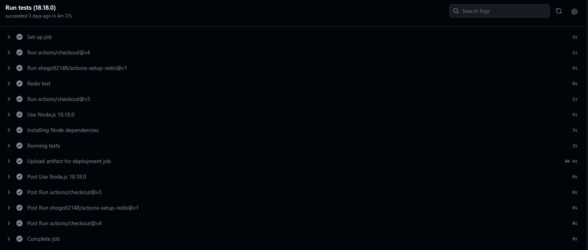

BONUS: If these tests pass correctly we can move on to the second step of the integration which is in our case building and publishing the Docker image. It can be verify boring and repetitive to do it by hand each time. Thus we've create a second job in the GitHub Action that automatically builds and pushes the image to DockerHub. Thanks to this job we always know that the version available on DockerHub is always the latest. This job depends on the succes of the testing job because we don't want to build and publish a buggy application that didn't pass all test.

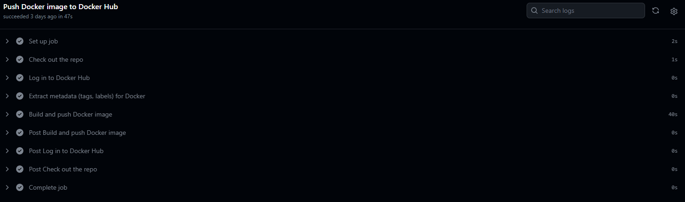

## CD

The last job of this pipeline is to deploy the application to Azure. To do so we've created a Ressource Group in Azure that hosts a Azure Web App Service.

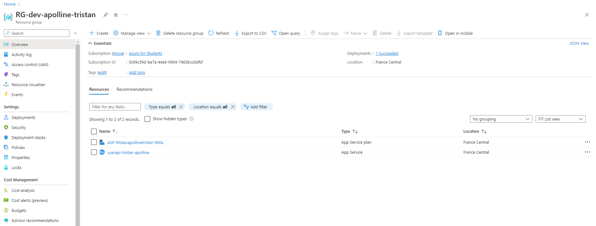

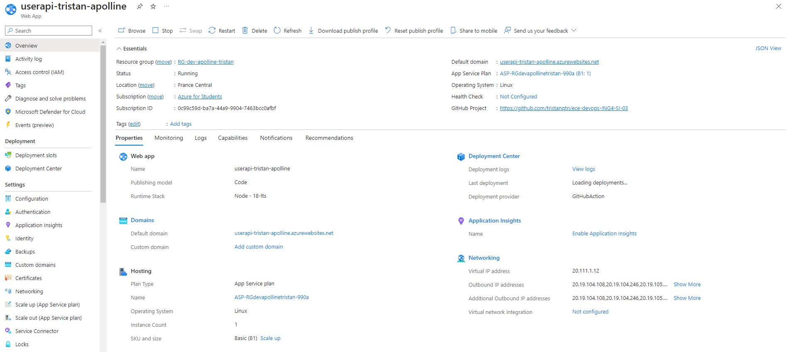

And using the `publishProfile` of this Azure ressource we're able to connect GitHub to Azure and automate the deployment. This job depends on the succes of the testing job because we don't want to deploy a buggy application that didn't pass all test.

[App running in Azure](https://userapi-tristan-apolline.azurewebsites.net/): **IMPORTANT**: This version of the userapi hasn't been connected on purpose to a Redis DB because that result in a publicly accessible DB which is a major security threat.

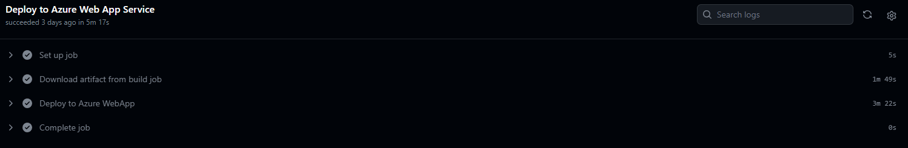

When all of these 3 jobs are finished the new version of the application has been deployed and the latest image pushed to DockerHub. We end up with the following working tree:

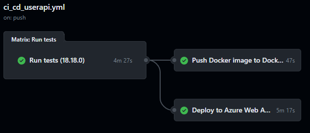

# Infrastructure as a Code

At this step we will be deploying our application inside a VM dedicated to run the app. To create the VM we will be using [Vagrant](https://www.vagrantup.com/) and for provisioning and configuration of this VM we will be using [Ansible](https://www.ansible.com/). Those two will do the definition of a VM, copying necessary files, and executing Ansible playbooks and shell scripts to set up the desired environment.

## Allocating VM

This part is refering to the [Vagrantfile](./iac/Vagrantfile).

1. **VM Definition:**

A VM named "nodeapp_server" is defined using the CentOS 7 box.
Port forwarding is set up to map port 3000 on the guest VM to port 3000 on the host machine.
The VM is configured with specific resources (memory and CPUs) for both VirtualBox and VMware providers.

2. **File Provisioning:**

The local ../userapi directory is copied to the VM's $HOME/nodeapp directory. At this step we are installing our NodeJS app code inside the VM.

3. **Ansible Provisioning:**

Ansible is used for provisioning with the local playbook playbooks/run.yml.
Only the roles with the tags "install" and "integrity" will be executed.

4. **Shell Provisioning:**

A shell script [app_launcher.sh](./iac/app_launcher.sh) is executed on every provision. This script performs once again integrity tests and then open port 3000 of the VM to external connection an finally starts our NodeJS application.

## Provisioning VM with Ansible

We need to configure this VM in order to host the application on it, this configuration process will be done by Ansible.

### Installation

The installation is ensured by Ansible, to do so we provide Ansible with a [playbook](./iac/playbooks/roles/nodeapp/install/tasks/main.yml) that explains all required steps to be performed. Here's an explanation of those steps. At the end of this play book the VM is completly configured to host the app (Redis is installed and runnig, firewalls are opened, language runtime is installed, app launcher is ready, ...).

1. **Install Required Packages:**

   - Uses the `yum` module to ensure that various packages (e.g., `curl`, `redis`, `nodejs`, etc.) are installed and up-to-date.

2. **Enable and Start SSH:**

   - Ensures that the SSH service (`sshd`) is started and enabled for automatic startup.

3. **Enable HTTP+HTTPS Access:**

   - Configures firewalld to enable permanent access for HTTP and HTTPS services.

4. **Reload Firewalld:**

   - Reloads the firewalld service to apply the new configuration.

5. **Starting REDIS:**

   - Uses the `command` module to start the Redis service using `systemctl`.

6. **Install Node Packages:**

   - Uses the `command` module to install Node.js packages for the specified directory (`/home/vagrant/nodeapp/`) using npm.

7. **Changing Permissions for App Launcher:**
   - Changes the permissions of the `app_launcher.sh` script to make it executable.

This Ansible playbook automates the installation and configuration of necessary packages and services for a system running a Node.js application. It also includes tasks for firewall configuration, service management, and script execution. The playbook ensures that the system is properly configured to run our application.

### Integrity tests

Health checks are performed by another [playbook](./iac/playbooks/roles/nodeapp/healthchecks/tasks/main.yml). This one ensures that the environment is ready to host the application.

**Running Integrity Tests:**

- Uses the `command` module to execute a health check command.
- Runs the `npm run test` command for the Node.js application located in `/home/vagrant/nodeapp/`. And checks that all tests are passed correctly.

This Ansible task is responsible for triggering the integrity tests for the Node.js application, providing a mechanism to verify that the application is in a healthy and expected state. The health check is essential for ensuring the reliability and correctness of the deployed application.

## Running app in Vagrant VM

To run this NodeJS app in Vagrant VM make sure Vagrant and VirtualBox are installed and configured.

Then, browse to the `./iac` folder.

```bash
cd iac
```

Perform the following command in the `./iac` folder to start the VM provisioning, the NodeJS app will start automatically if the provisioning step has been done correctly.

```bash
vagrant up
```


To destroy the VM, first stop the NodeJS application and run this command:

```bash
vagrant destroy
```

# Docker Image

In order to make the application usable in environments such as Docker Compose or Kubernetes, we first need to create the docker image og the application. To do so we've created the [DockerFile](./userapi/Dockerfile) which is responsible for the creation of the image.

Note that for this image it's useless to upload folders and files such has `./test`, `eslintrc.json`, `DockerFile` itself, ... Thus we've added a [.dockerignore](./userapi/.dockerignore) to tell the DockerFile which files and folders aren't required in the image.

Before performing the following instructions make sure Docker is installed and running on your device.

## Building the image

Browse to the `./userapi` folder.

```bash
cd userapi
```

Build the image with this command:

```bash
docker build -t userapi-devops .
```

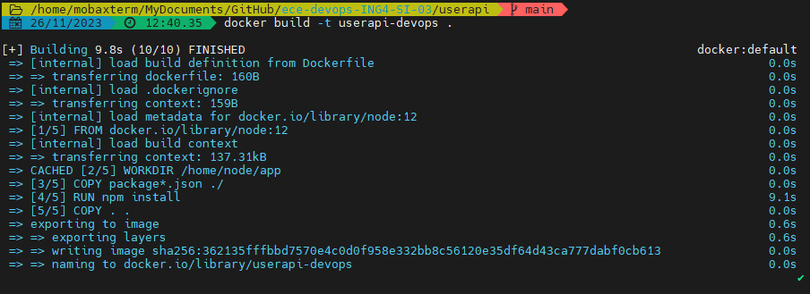

## Publishing the image

Before publishing the image make sure you have a [DockerHub](https://hub.docker.com/) account.

```bash
docker tag userapi $YOUR_USERNAME/userapi-devops:latest
docker login
docker push $YOUR_USERNAME/userapi-devops:latest
```

The image is now available online. Thus you can perform the installation of this image on any compatible device without needing the source code.

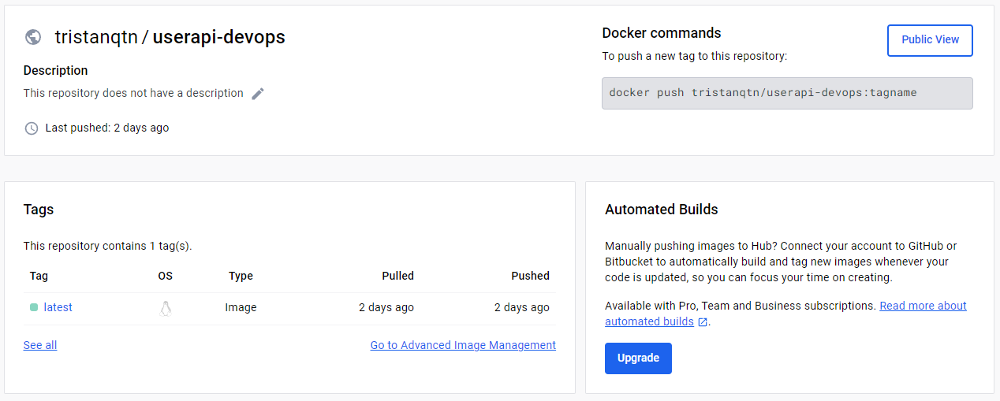

Thanks to the DockerHub platform, the image of our application is available online for everyone. Find it using this [link](https://hub.docker.com/repository/docker/tristanqtn/userapi-devops/general).

## Automation pipeline

As explained [above](#ci), we've created a bonus CI/CD pipeline job to automate all the steps involved in compiling and publishing the docker image. Now we don't need to build and publish each new version of the USER API beacause it will be done automatically for us on each merge or push to main branch.


## Running the image

Run the container, pay attention that this container requires a REDIS DB to work well. Thus make sure another container is hosting a REDIS DB with an open port on 6379 or a Redis instance is installed and running on the device hosting the container. In order to access the application a port binding is required as follows.

Locally built image:

```bash
docker run -p 3000:3000 -d userapi
```

Image available on DockerHub:

```bash
docker run -p 3000:3000 -d tristanqtn/userapi-devops:latest
```

If you don't have Redis installed and you can't install it, don't worry we've created a [Docker Compose file](./tools/standalone_redis/docker-compose.yaml). Run the `docker compose up` command in the given folder `./labs/tools/standalone_redis/`, this will start a standalone Redis server with the correct port mapping.

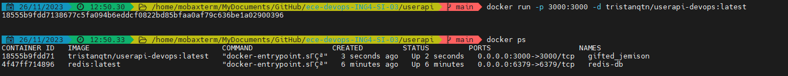

You can see on the screenshot above that the container is running. We've just created a Redis container to make sure that the USER API is running correctly. Those two are completly independent even though the API is using the Redis container.

# Docker Compose

Docker Compose is a powerful tool that simplifies the deployment of multi-container applications. To create a docker compose we have to create a [docker-compose.yaml](./docker-compose.yaml) file.

In this docker compose, two services are defined: `redis` and `userapi`. The redis service is based on the latest Redis image, exposing its `port 6379` (native port of Redis). This container hosts a Redis instance that will be used by the other container hosting the application. The userapi service, encapsulating a Node.js web application, relies on a custom image `tristanqtn/userapi-devops:latest` (image that we built and published previously) and exposes its functionality on `port 3000`.

Importantly, the userapi service specifies dependencies using the `depends_on` directive, ensuring that the Redis service is fully initialized before the Node.js application starts. Additionally, environmental variables `REDIS_HOST` and `REDIS_PORT` are set, establishing communication between the services.

Before starting the Docker Compose, make sure Docker is running on your device and the `docker-compose` extension is installed too. Then run the following command:

```bash
docker compose up
```

A cluster of two containers should now be running on your device. Let them time to start and when you see the following line in your command prompt: `nodejs-webapp  | Server listening the port 3000` you can start using the [application](http://localhost:3000).

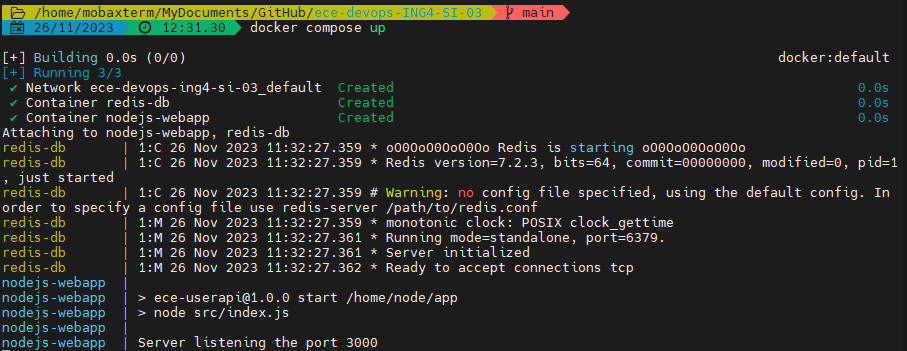

To stop the Docker Compose cluster you can either use the command `CTRL + C` or the following Docker command (will delete the whole cluster):

```bash
docker compose down
```

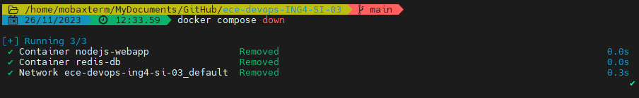

We didn't implement persistent volumes in the docker compose because we thought it would be more challenging to setup in the K8S environment, and thus funnier to do.

# Orchestration with K8S

[Kubernetes](https://kubernetes.io/) is an open-source container orchestration platform, and these configurations are part of its persistent storage system. Before reading and experimenting this part, make sure you understand those K8S terms: cluster, node, pod, deployments, services, PV and PVC.

## PV and PVC

These tools (Persistent Volume and Persistent Volume Claim) facilitate the dynamic provisioning and consumption of persistent storage in a Kubernetes cluster, ensuring data persistence for applications like Redis that require durable storage beyond the lifecycle of individual pods.

### Persistent Volume

This [YAML](./k8s/redis-pv.yaml) file defines a Kubernetes PersistentVolume (PV) named `redis-pv`. It specifies attributes such as storage capacity (1Gi), access modes (read-write-once), reclaim policy (Retain), and a host path on the underlying node where the volume is physically stored ("/mnt/data") here in the Minikube node.

A K8S PV is represents physical storage resources in the cluster. But this storage need to be claim by a pod to be used, this will be the role of the PVC.

### Persistent Volume Claim

This [YAML](./k8s/redis-pvc.yaml) file defines a Kubernetes PersistentVolumeClaim (PVC) named `redis-pvc`. It specifies that the claim requires 1Gi of storage with a read-write-once access mode. A PVC is a request for storage that can be fulfilled by a PV. In this case, it is designed to bind to the previously defined `redis-pv` for storage.

A K8S PVC is a request for storage by a user or a pod.

We're using PV and PVC to make the data stored in the Redis pod persistent, thus if this pod has to restart or to be down for a moment, the data won't be lost because it's stored persistently in the PV mounted inside Minikube.

## Services

Service facilitate the seamless connectivity between different components of the application within the Kubernetes cluster and could be used to enable external access to a pod. In our case we'll define two services, one for expsoing the redis native port so that the redis pod can be exploited b the NodeJS app and another one responsible for exposing the running port of the NodeJS app to external access (outside of the node).

This [redis-service](./k8s/service.yaml) defines a Kubernetes Service named `redis-service`. Services in Kubernetes enable communication between different sets of pods. This service is configured to route traffic to pods with the label app: redis based on the specified selector. It exposes the Redis pod on `port 6379` within the cluster.

This [nodejs-app-service](./k8s/service.yaml) defines a Kubernetes Service named `nodejs-app-service`. Similar to `redis-service`, it facilitates communication between pods, but in this case, it selects pods with the label app: nodejs-app. It exposes the Node.js application to external traffic on `port 3000`.

## Pods and Deployement

Now that PV and PVC has been defined to enable data persistence, and that some services will be used to ensure inside and outside node connectivity between pods, we can finally deploy the application.

This [deployment file](./k8s/deployment.yaml) enables the orchestrated deployment and scaling of the Redis and Node.js applications in a Kubernetes cluster. The applications are configured to communicate seamlessly and leverage persistent storage for data durability.

This [redis-deployment](./k8s/deployment.yaml) defines a Kubernetes Deployment named `redis-deployment` for the Redis database. It ensures that one replica of the Redis pod is always running. The pod specification includes a Redis container, using the latest Redis image, and mounts a persistent volume `redis-storage` at the path `/data` for data persistence. The container exposes `port 6379`, and the volume is dynamically provisioned using the `redis-pvc` PersistentVolumeClaim.

This [nodejs-app-deployment](./k8s/deployment.yaml) defines a Kubernetes Deployment named `nodejs-app-deployment` for the USER API application. It ensures that one replica of the Node.js pod is always running. The pod specification includes a Node.js container, using a our image, exposing `port 3000`. Environment variables `REDIS_HOST` and `REDIS_PORT` are set to establish communication with the Redis service `redis-service`, making it aware of the Redis pod's location.

## Running app in K8S

1. Make sure [Minikube](https://minikube.sigs.k8s.io/docs/start/) and [kubectl](https://kubernetes.io/docs/tasks/tools/) are installed on your device. Then start the minikube node and then check the status of it with the two commands:

```bash
minikube start
minikube status
```

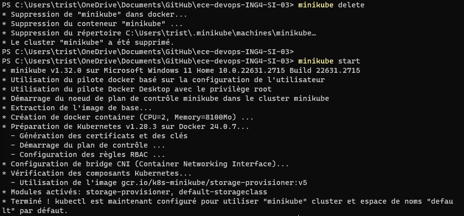

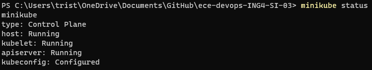

Then apply in the order those files: `redis-pv.yaml` => `redis-pvc.yaml` => `service.yaml` => `deployment.yaml`. This will deploy all needed tools and finally deploy the application.

```bash
kubectl apply -f redis-pv.yaml
kubectl apply -f redis-pvc.yaml
kubectl apply -f service.yaml
kubectl apply -f deployment.yaml
```

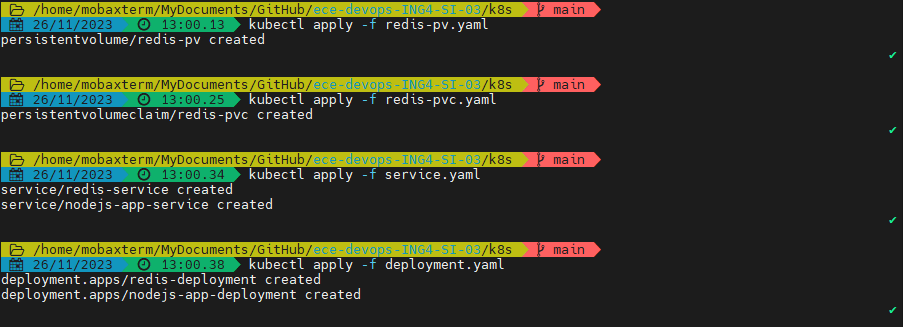

Make sure everything is ok with the following commands. All pods should be running with no restarting loops. Access the logs of the NodeJS app pod to make sure that the application is healthy and running on `port 3000`.

```bash
kubectl get pods
kubectl logs $NAME_OF_NODEJS_APP_POD
```

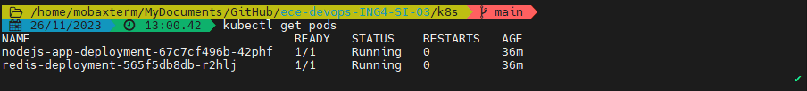
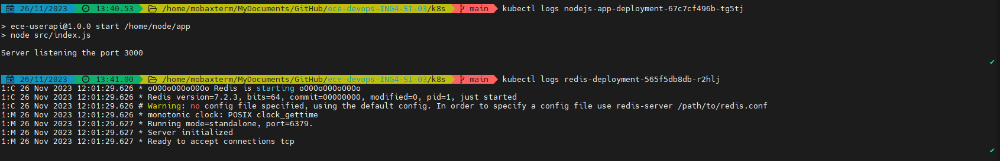

Since the app is running in a pod and the pode is inside a node you have to create a tunnel directly to the NodeJS app with this command (the command uses the service that open the NodeJS pod to outside connection on `port 3000` defined before):

```bash
minikube service nodejs-app-service
```

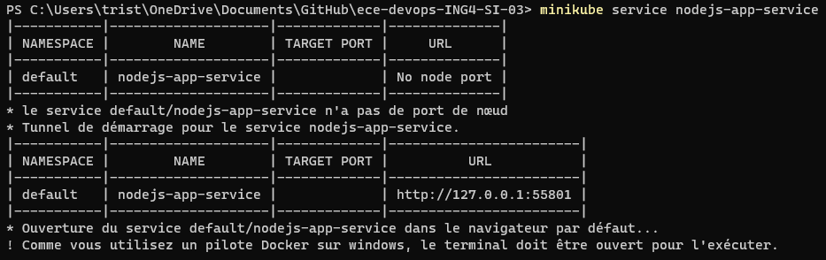


To delete the application and all deployments you can perform a clean exit with the following command or destroy the node with `minikube delete`:

```bash
kubectl delete deployment redis-deployment
kubectl delete deployment nodejs-app-deployment
kubectl delete service nodejs-app-service
kubectl delete service redis-service
kubectl delete pvc redis-pvc
kubectl delete pv redis-pv
```

A simple script to perform this cleaning has been created [here](./labs/tools/k8s/user_api_cleaner.sh).

Deleting services, PV, PVC and deployments:

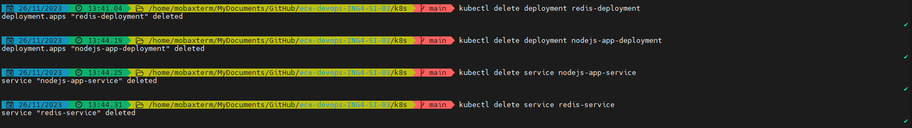

Deleting minikube node directly:

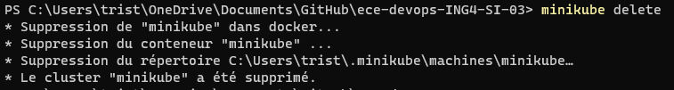

# Istio in K8S

In the previous step we deployed our application in a K8S cluster but to stop there would be to miss out on the advanced functionality of Kubernetes. So in this part of the project we're going to build on the work done previously in K8S and take it to the next level. With Istio, we'll implement service mesh in our application, and with the help of Prometeus and Grafana, we'll be able to monitor the K8S cluster in real time and set alerts in the event of failure.

In short, we'll be configuring the K8S environment to monitor our application and the health of the cluster, as well as managing intra-cluster routing.

## Deploy NodeJS app with istio

The first step is to configure an empty K8S cluster with Istio. to do so, browse into the `istio` folder:

```bash
cd istio
```

Then we must give more ressources than usual to the node because installing Istio will consume a lot of resources. Make sure no minikube node is running or already define and then create the new node:

```bash
minikube delete
minikube start --cpus 6 --memory 8192
```

Just like `kubectl` there's and `istioctl` command used to manage istio inside a node. To add istioctl command to your command prompt you should update locally the `PATH` environnement variable. To do so, run the `pwd` command to get the location of your working directory and then update the `PATH` variable with this path. Dont forget to add the bien folder at the end of the path.

```bash
pwd
/home/tristan/Documents/GitHub/ece-devops-ING4-SI-03/istio/
export PATH=$PATH:/home/tristan/Documents/GitHub/ece-devops-ING4-SI-03/istio/bin
```

Now the `istioctl` command should be available in you instance of your command prompt.


IMPORTANT: This configuration is specific to the window of your command prompt, if you fire a new command prompt the `istioctl` command won't be defined.

At this point you should have an empty K8S cluster running. Check with the two following commands that the cluster is empty and nothing is running:

```bash
kubectl get ns
kubectl get pods
```


It is time to install Istio inside our cluster:

```bash
istioctl install
```

Istio should create two pods and a namespace, check that the installation has ended correctly with those two commands:

```bash
kubectl get ns
kubectl get pod -n istio-system
```

The result of the Istio installation should look like this:


In order to deploy our application pods using the Istio management we have to create a namespace label inside de ndoe.

```bash
kubectl label namespace default istio-injection=enabled
```

Check that the label has been added to the default namespace with this command:

```bash
kubectl get ns default --show-labels
NAME      STATUS   AGE   LABELS
default   Active   18d   istio-injection=enabled,kubernetes.io/metadata.name=default
```

It's now time to deploy the NodeJS application inside the node. We have created a [manifest](./istio/manifest.yaml) file. This file is just the concatenation of all files of the [k8s folder](./k8s/). Thus when executing this `manifest.yaml` with the `kubectl apply` command, it will create 3 pods for the NodeJS app (because we want to do some service mesh), a pod for Redis, a service for each pod and will manage the persistent volume for Redis.

```bash
kubectl apply -f manifest.yaml
persistentvolume/redis-pv created
persistentvolumeclaim/redis-pvc created
service/redis-service created
service/nodejs-app-service created
deployment.apps/redis-deployment created
deployment.apps/nodejs-app-deployment created
```

Note the difference with the previous section, now when we deploy with Istio, it creates two containers instead of one for each pod. This is due to the functioning of Istio.

```bash
kubectl get pods
NAME                                    READY   STATUS    RESTARTS   AGE
nodejs-app-deployment-946675b48-qldht   2/2     Running   0          20s
redis-deployment-57fb5c959b-cldrz       2/2     Running   0          20s
```


You can even check the architecture of an Istio managed pod with the following command:

```bash
kubectl describe pod $YOU_POD_NAME
```

Now our application is deployed inside and Istio managed cluster. In the following steps we'll plug addons in the cluster to fully exploit all Istio features.

## Deploy addons in K8S cluster

To deploy the addons we just have to run the following command inside the [istio](./istio/) folder. This will install Grafana, Prometheus, Kiali, ...

```bash
kubectl apply -f /addons/
```

Make sure all pods have been created with the correct namespace:

```bash
kubectl get pods -n istio-system
NAME                                    READY   STATUS    RESTARTS   AGE
grafana-5f9b8c6c5d-4tmvk                1/1     Running   0          31m
istio-ingressgateway-56558c9fd7-f75bg   1/1     Running   0          48m
istiod-7d4885fc54-m9bws                 1/1     Running   0          48m
jaeger-db6bdfcb4-nr5q4                  1/1     Running   0          31m
kiali-cc67f8648-hj2gg                   1/1     Running   0          31m
prometheus-5d5d6d6fc-zt8rr              2/2     Running   0          31m
```


### Service Mesh

Some services have been created to be able to access all addons. Make sure they are running and healthy with this command.

```bash
kubectl get services -n istio-system
NAME                   TYPE           CLUSTER-IP       EXTERNAL-IP   PORT(S)                                          AGE
grafana                ClusterIP      10.101.141.166   <none>        3000/TCP                                         82s
istio-ingressgateway   LoadBalancer   10.111.32.227    <pending>     15021:31482/TCP,80:32750/TCP,443:30541/TCP       18m
istiod                 ClusterIP      10.96.130.232    <none>        15010/TCP,15012/TCP,443/TCP,15014/TCP            18m
jaeger-collector       ClusterIP      10.100.255.191   <none>        14268/TCP,14250/TCP,9411/TCP,4317/TCP,4318/TCP   82s
kiali                  ClusterIP      10.102.186.192   <none>        20001/TCP,9090/TCP                               81s
loki-headless          ClusterIP      None             <none>        3100/TCP                                         81s
prometheus             ClusterIP      10.97.230.76     <none>        9090/TCP                                         81s
tracing                ClusterIP      10.104.184.68    <none>        80/TCP,16685/TCP                                 82s
zipkin                 ClusterIP      10.107.243.53    <none>        9411/TCP                                         82s
```


To access a service we have to do some port forwarding between the node port and the localhost port. To do so we use to following command.

```bash
kubectl port-forward svc/$SERVICE_NAME -n istio-system $SERVICE_PORT
```

For example to access the [Kiali dashboard](http://localhost:20001). We use to command given below.

```bash
kubectl port-forward svc/kiali -n istio-system 20001
```

And now Kiali should be accessible from : [Kiali dashboard](http://localhost:20001). You're now in the Kiali dashboard and you can now play arround with service mesh and workload balancing. The 3 replicas of the NodeJS application are meant to be use for practicing service mesh.

Kiali dashboard:


Pods managed by Istio:


App graph (connections appear when the app is in use):


### Monitoring

Some services have been created to be able to access all addons. Make sure they are running and healthy with this command.

```bash
kubectl get services -n istio-system
NAME                   TYPE           CLUSTER-IP       EXTERNAL-IP   PORT(S)                                          AGE
grafana                ClusterIP      10.101.141.166   <none>        3000/TCP                                         82s
istio-ingressgateway   LoadBalancer   10.111.32.227    <pending>     15021:31482/TCP,80:32750/TCP,443:30541/TCP       18m
istiod                 ClusterIP      10.96.130.232    <none>        15010/TCP,15012/TCP,443/TCP,15014/TCP            18m
jaeger-collector       ClusterIP      10.100.255.191   <none>        14268/TCP,14250/TCP,9411/TCP,4317/TCP,4318/TCP   82s
kiali                  ClusterIP      10.102.186.192   <none>        20001/TCP,9090/TCP                               81s
loki-headless          ClusterIP      None             <none>        3100/TCP                                         81s
prometheus             ClusterIP      10.97.230.76     <none>        9090/TCP                                         81s
tracing                ClusterIP      10.104.184.68    <none>        80/TCP,16685/TCP                                 82s
zipkin                 ClusterIP      10.107.243.53    <none>        9411/TCP                                         82s
```


To access a service we have to do some port forwarding between the node port and the localhost port. To do so we use to following command.

```bash
kubectl port-forward svc/$SERVICE_NAME -n istio-system $SERVICE_PORT
```

For example to access the [Grafana dashboard](http://localhost:3000). We use to command given below.

```bash
kubectl port-forward svc/grafana -n istio-system 3000
```

For [Prometheus dashboard](http://localhost:9090):

```bash
kubectl port-forward svc/prometheus -n istio-system 9090
```

We are now able to access either [Grafana](http://localhost:3000) or [Prometheus](http://localhost:9090). Using these two tools, we have defined a very basic metrics capture. This metrics capture checks the health of containers in the cluster and also measures the consumption of resources in the node.

Grafana Dashboard:


Grafana metrics control dashboard:


Prometheus dashboard:


## Limitations

For this part of the project we encountered many problems. These problems were not resource-related, as we were using a sufficiently powerful machine (32GB of RAM and 16 CPUS). To this day, we can't explain why we had so many problems. Despite these problems, the mission was accomplished: the mesh service has been set up and can be configured thanks to Kiali, and the pods and resources are monitored by Prometheus and Grafana.

We weren't able to create alerts between Prometheus and Grafana.

---

Still in keeping with DevOps logic and culture, launching a K8S cluster managed by Istio can be laborious, so we created a shell script that automates the launch and configuration of the cluster, as well as the installation of Istio, addons and our entire application.

[Automation Script](./tools/k8s/setup_istio.sh)

# Helm Integration

## Why Helm?

[Helm](https://helm.sh/) is a package manager for Kubernetes that simplifies deploying and managing applications on Kubernetes clusters. It allows us to define, install, and upgrade even the most complex Kubernetes applications. We choose here to add this Helm deployment has a bonus to show that K8S deployments can be done with variabilisation. It's interesting to use such features when deploying the same application in different K8S configurations.

Using Helm will make it easier to deploy and uninstall our application in a K8S cluster.

## Implementation

We've integrated Helm into our project to streamline the deployment process and manage Kubernetes manifests efficiently. Helm provides a standardized way to package, distribute, and manage Kubernetes applications, making it easier to share and reproduce deployments.

Follow these steps to deploy the project using Helm:

### Prerequisites

- [Helm installed](https://helm.sh/docs/intro/install/)

#### Step 1: Customize Values

Edit the [values.yaml](./helm/values.yaml) file in the `helm` directory to configure your deployment settings, such as image repository, tag, and any other customizable values.

#### Step 2: Install Helm Chart

Run the following command to install the Helm chart (from the root of this repo):

```bash
helm install mydeployment ./helm -f helm/values.yaml
```

Replace `mydeployment` with your desired release name. One the installation has been performed by Helm, you should end up with something like this:

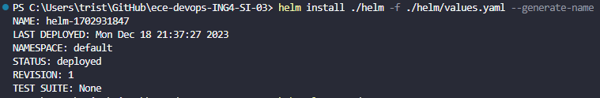

We strongly recommend you to try to deploy our application in an Istio managed cluster using Helm.

#### Step 3: Verify Deployment

Check the status of your deployment:

```bash
kubectl get deployments
kubectl get services
kubectl get pv
kubectl get pvc
```

When pods are started check the API health by sending a GET request to the `/health` route. If the answer is positive then go and use the API.

Since the app is running in a pod and the pode is inside a node you have to create a tunnel directly to the NodeJS app with this command (the command uses the service that open the NodeJS pod to outside connection on `port 3000` defined before):

```bash
minikube service nodejs-app-service
```


#### Step 4: Upgrade Deployment (Optional)

If you make changes to your application or configuration, you can upgrade the deployment using:

```bash
helm upgrade mydeployment ./helm -f helm/values.yaml
```

#### Step 5: Uninstall Deployment

To uninstall and delete the deployment, run:

```bash
helm uninstall mydeployment
```

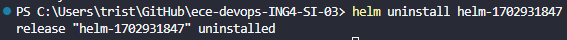

# Bonuses

Here's a list of all additional features we've added to our project:

- Automated deployment using variables with Helm
- CI job for automated build and publish to DockerHub of the USER API image
- API health endpoint
- Implementation of new API methods
  - Update the information of a user
  - Delete a user
  - Get all keys stored in Redis
- Improved tests and new tests for every new API method
- API documentation using Swagger UI
- Complete DevOps toolbox

## Toolbox

In keeping with the devops spirit, we also created a number of shell script that were useful throughout the project. These scripts are basic, but they save a lot of time, because you can run them and concentrate on other things, without having to wait for each command to finish before launching the next one.

This [toolbox](./tools/) contains the following scripts:

- automated Docker build and publish for USER API app
- automated deployment of the USER API app in the K8S cluster (including PV, PVC, services and pods deployment)
- automated cluster cleaner for K8S (deleting PV, PVC, services and deployments)
- standalone Dockerized Redis container for local dev
- automated deployment of the NodeJS app in the K8S cluster management with Istio for service mesh and monitoring

IMPORTANT: Those scripts are path sensitive, they have been created to be executed from the root of the project `/ece-devops-ING4-SI-03`. PLease run them as foolows:

```bash
ece-devops-ING4-SI-03$ chmod +x tools/k8s/user_api_launcher.sh
ece-devops-ING4-SI-03$ sh tools/k8s/user_api_launcher.sh
```

```bash
ece-devops-ING4-SI-03$ chmod +x tools/k8s/user_api_cleaner.sh
ece-devops-ING4-SI-03$ sh tools/k8s/user_api_cleaner.sh
```

```bash
ece-devops-ING4-SI-03$ chmod +x tools/standalone_redis/start.sh
ece-devops-ING4-SI-03$ sh tools/standalone_redis/start.sh
```

```bash
ece-devops-ING4-SI-03$ chmod +x tools/docker/image_builder.sh
ece-devops-ING4-SI-03$ sh tools/docker/image_builder.sh
```

```bash
ece-devops-ING4-SI-03$ chmod +x ./tools/k8s/setup_istio.sh
ece-devops-ING4-SI-03$ sh ./tools/k8s/setup_istio.sh
```

chmod +x ./tools/k8s/setup_istio.sh

# Useful Links

1. USER API

- [NodeJS](https://nodejs.org/en)
- [NPM - Express](https://www.npmjs.com/package/express)
- [NPM - Swagger UI](https://www.npmjs.com/package/swagger-ui)
- [Redis](https://redis.io/)

2. CI/CD Pipeline

- [CI/CD Pipelines](https://www.redhat.com/en/topics/devops/what-is-ci-cd?cicd=32h281b)
- [GitHub Actions](https://github.com/features/actions)
- [DockerHub](https://hub.docker.com/)
- [Azure App Service](https://azure.microsoft.com/fr-fr/products/app-service)

3. Infrastructure as a Code

- [Vagrant](https://www.vagrantup.com/)
- [Ansible](https://www.ansible.com/)
- [VirtualBox](https://www.virtualbox.org/)

4. Docker Image

- [Docker Builds](https://docs.docker.com/engine/reference/commandline/build/)
- [DockerHub](https://hub.docker.com/)

5. Docker Compose

- [Docker Compose](https://docs.docker.com/compose/)

6. Orchestration with K8S

- [K8S](https://kubernetes.io/)
- [Minikube](https://minikube.sigs.k8s.io/docs/start/)
- [kubectl](https://kubernetes.io/docs/reference/kubectl/)

8. Istio serivce mesh and monitoring

- [Istio](https://istio.io/)
- [Kiali](https://kiali.io/)
- [Prometheus](https://prometheus.io/)
- [Grafana](https://grafana.com/)

9. Helm Integration

- [Helm](https://helm.sh/)

10. Tools and Software used:

- [GitHub Desktop](https://desktop.github.com/)
- [VS Code](https://code.visualstudio.com/)
- [MobaXTerm](https://mobaxterm.mobatek.net/)
- [Docker Desktop](https://www.docker.com/products/docker-desktop/sualstudio.com/)
- [Postman](https://www.postman.com/)

# Authors

- Apolline PETIT: apolline.petit@edu.ece.fr
- Tristan QUERTON: tristan.querton@edu.ece.fr
