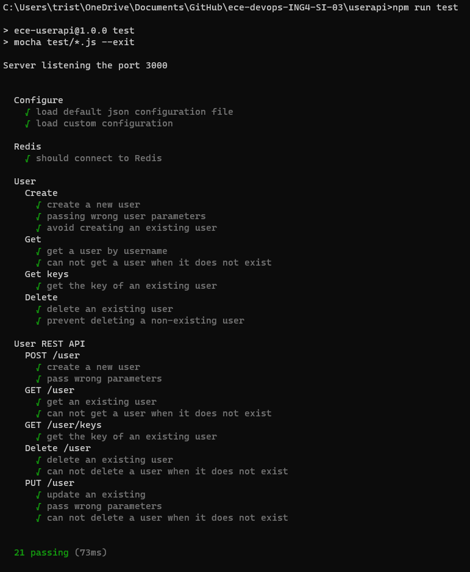

# DevOps Project

# State of the project

| Subject                                                         | Code | DONE |
| :-------------------------------------------------------------- | :--: | :--: |
| Enriched web application with automated tests                   | APP  |  ✔   |
| Continuous Integration and Continuous Delivery (and Deployment) | CICD |  ✔   |
| Containerisation with Docker                                    |  D   |  ✔   |
| Orchestration with Docker Compose                               |  DC  |  ✔   |
| Orchestration with Kubernetes                                   | KUB  |  ✔   |
| Service mesh using Istio                                        | IST  |      |
| Infrastructure as code using Ansible                            | IAC  |  ✔   |
| Monitoring                                                      | MON  |      |
| Accurate project documentation in README.md file                | DOC  |  ✔   |

| Bonuses                                                                   |     |
| :------------------------------------------------------------------------ | :-: |
| CI job for automated build and publish to DockerHub of the USER API image |  ✔  |
| Implementation of new API methods (Update, Delete, Get all keys)          |  ✔  |
| Improved tests and new tests for every new API method                     |  ✔  |
| API documentation using Swagger UI                                        |  ✔  |
| API health endpoint                                                       |  ✔  |

# Summary

1. [USER API](#user-api)
   1. [Installation](#installation)
   2. [Usage](#usage)
   3. [Testing](#testing)
   4. [Documentation](#documentation)
2. [CI/CD Pipeline](#cicd-pipeline)
   1. [CI](#ci)
   1. [CD](#cd)
3. [Infrastructure as a Code](#infrastructure-as-a-code)
   1. [Allocating VM](#allocating-vm)
   2. [Provisionning VM with Ansible](#provisionning-vm-with-ansible)
4. [Docker Image](#docker-image)
   1. [Building the image](#building-the-image)
   2. [Publishing the image](#publishing-the-image)
   3. [Automation pipeline](#automation-pipeline)
   4. [Running the image](#running-the-image)
5. [Docker Compose](#docker-compose)
6. [Orchestration with K8S](#orchestration-with-k8s)
   1. [PV and PVC](#pv-and-pvc)
   2. [Services](#services)
   3. [Pods and Deployment](#pods-and-deployement)
   4. [Running app in K8S](#running-app-in-k8s)
7. [Bonuses](#bonuses)
8. [Useful Links](#useful-links)
9. [Authors](#authors)

# USER API

It is a basic NodeJS web application exposing REST API that creates and stores user parameters in [Redis database](https://redis.io/). This application always the USER to perform CRUD operations.

The source code of the application is available at [Source Code](./userapi/src/)

## Installation

This application is written on NodeJS and it uses Redis database. Follow the instructions below to perform the complete installation of this application.

1. [Install NodeJS](https://nodejs.org/en/download/)

2. [Install Redis](https://redis.io/download)

3. Clone our repo to your computer:

```bash
git clone https://github.com/tristanqtn/ece-devops-ING4-SI-03/
```

4. Navigate to the freshly downloaded repo:

```bash
cd ece-devops-ING4-SI-03
cd userapi
```

5. Since node modules are not present in this repo you should install them manually using the following command:

```bash
npm install
```

If you've followed the instructions above, the entire project is installed on your machine and you have the tools (NodeJS and Redis) to run this application locally. The type of installation you've just performed is comparable to a dev-type installation.

Furthermore, the aim of this project is to deploy this same application in a variety of environments, so in the rest of this documentation you'll learn how to deploy the application using different methods.

## Usage

Here few explanations concerning the usage of the application in local mode. This type of deployment requires that Redis and NodeJS are already installed on the hosting device. Redis must be running when you use the application. To make sure Redis is running use the command `redis-cli PING` and Redis should answer with `PONG`.

Start a web server: in the `./userapi` folder run the following command to perform the Node modules installation.

```bash
npm start
```

For dev mode:

```bash
npm run dev
```

It will start a web server available in your browser at `http://localhost:3000`.


Now the application is running on your device and you should be able to access the application home page at [USER API - home](http://localhost:3000). This home page explains you how to use the whole application.


Here's a list of operations available using the REST API. For API testing we strongly recommend to use [Postman](https://www.postman.com/).

1. Create a user

This method will allow you to insert a new user in the Redis DB. Send a POST (REST protocol) request using the following command:

```bash
curl --header "Content-Type: application/json" \
  --request POST \
  --data '{"username":"tristanqtn","firstname":"tristan","lastname":"querton"}' \
  http://localhost:3000/user
```

Or using Postman, send a POST request to `http://localhost:3000/user` with the following `json` body:

```json
{
  "username": "tristanqtn",
  "firstname": "tristan",
  "lastname": "querton"
}
```

The API should respond you with the following `json` message:

```json
{ "status": "success", "msg": "OK" }
```

2. Retrieve the information of a specific user

This method will allow you to retrieve the `firstname` and `lastname` of a user inserted in Redis using its `username`. To do so send a GET request to the API at `http://localhost:3000/user/:username` where `username` is the username of the user you want to get the information.

Use the following bash command to send the GET request:

```bash
curl http://localhost:3000/user/:username
```

Or using Postman, send a GET request to `http://localhost:3000/user/:username` with the correct `username` parameter.

The API should respond you with the following `json` message:

```json
{
  "status": "success",
  "msg": {
    "firstname": "tristan",
    "lastname": "querton"
  }
}
```

3. Retrieve all keys in the Redis database

This method will allow you to retrieve all keys stored in Redis. To do so send a GET request to the API at `http://localhost:3000/user/keys`.

Use the following bash command to send the GET request:

```bash
curl http://localhost:3000/user/keys
```

Or using Postman, send a GET request to `http://localhost:3000/user/keys`.

The API should respond you with the following `json` message:

```json
{
  "status": "success",
  "msg": ["tristan", "apolline"]
}
```

4. Update the information of a specific user

This method will allow you to update the information of an already inserted uder the Redis DB. Make sure to use the `username` of a user existing in the DB. Send a PUT (REST protocol) request using the following command:

```bash
curl --header "Content-Type: application/json" \
  --request PUT \
  --data '{"username":"tristanqtn","firstname":"tristan","lastname":"querton"}' \
  http://localhost:3000/user
```

Or using Postman, send a PUT request to `http://localhost:3000/user` with the following `json` body:

```json
{
  "username": "tristanqtn",
  "firstname": "tristan",
  "lastname": "querton"
}
```

The API should respond you with the following `json` message:

```json
{ "status": "success", "msg": "OK" }
```

5. Delete a specific user

This method will allow you to delete a user inserted in Redis using its `username`. To do so send a DELETE request to the API at `http://localhost:3000/user/:username` where `username` is the username of the user you want to delete.

Use the following bash command to send the GET request:

```bash
curl -X DELETE http://localhost:3000/user/:username
```

Or using Postman, send a DELETE request to `http://localhost:3000/user/:username` with the correct `username` parameter.

The API should respond you with the following `json` message:

```json
{
  "status": "success",
  "msg": 1
}
```

6. Health Endpoint

An API endpoint has been created to send the current health state of the application. Send a GET request to the `http://localhost:3000/health` (or curl it with `curl http://localhost:3000/health`) and the API should respond you with a message similar to the following one:

```json
{ "uptime": 389.8366598, "status": "OK", "timestamp": 1700817327148 }
```

## Testing

This application has been covered with tests. These tests will be useful for creating CI/CD pipelines. They are also useful for checking the integrity of the application after code has been added or modifications have been made. To run these tests make sure Redis is running with the command `redis-cli PING` and Redis should answer with `PONG`. Then run the following command that will automatically start the server and then perform the suite of tests.

```bash
npm run test
```

The code of the test scripts is available at [Tests](./userapi/test/)

Here's a list of all test that will be performed:

```
  Configure
    - load default json configuration file
    - load custom configuration

  Redis
    - should connect to Redis

  User
    Create
      - create a new user
      - passing wrong user parameters
      - avoid creating an existing user
    Get
      - get a user by username
      - can not get a user when it does not exist
    Get keys
      - get the key of an existing user
    Delete
      - delete an existing user
      - prevent deleting a non-existing user

  User REST API
    POST /user
      - create a new user
      - pass wrong parameters
    GET /user
      - get an existing user
      - can not get a user when it does not exist
    GET /user/keys
      - get the key of an existing user
    Delete /user
      - delete an existing user
      - can not delete a user when it does not exist
    PUT /user
      - update an existing
      - pass wrong parameters
      - can not delete a user when it does not exist
```

The expected output of the execution of all test script is the following screenshot:



## Documentation

A Swagger generator has been added to the API. The API description is available at [API Docs](http://localhost:3000/api-docs)

# CI/CD Pipeline

Using GitHub actions we have created a CI/CD pipeline. This pipeline is running on every push or accepted pull request. This pipeline is made out of two jobs. One ensures the Continuous Integration part and the other the Continuous Deployment. We could have perform those two jobs within a single job but it's part of the best practices to at least split the integration and the deployment.

The code of this CI/CD pipeline is available at [CI/CD](./.github/workflows/ci_cd_userapi.yml)

CI/CD Pipelines are not executed locally but on a GitHub server similar to a production environment. Thus, for each job we need to tell the server which dependencies are required. We run those pipelines on a clean remote server because we want to reproduce a production environment.

## CI

CI stands for Continuous Integration. This job is responsible of making sur that the added code (pushed or merged) is integrating correctly with the legacy code. Verification of correct integration is carried out by some tests coded by the developer. Before run the test the pipeline installs on the container running the job the needed dependencies: Redis and NodeJS. If all these tests pass without error, it means that the new code integrates well with the old one.


BONUS: If these tests pass correctly we can move on to the second step of the integration which is in our case building and publishing the Docker image. It can be verify boring and repetitive to do it by hand each time. Thus we've create a second job in the GitHub Action that automatically builds and pushes the image to DockerHub. Thanks to this job we always know that the version available on DockerHub is always the latest. This job depends on the succes of the testing job because we don't want to build and publish a buggy application that didn't pass all test.


## CD

The last job of this pipeline is to deploy the application to Azure. To do so we've created a Ressource Group in Azure that hosts a Azure Web App Service. And using the `publishProfile` of this Azure ressource we're able to connect GitHub to Azure and automate the deployment. This job depends on the succes of the testing job because we don't want to deploy a buggy application that didn't pass all test.

[App running in Azure](https://userapi-tristan-apolline.azurewebsites.net/)


When all of these 3 jobs are finished the new version of the application has been deployed and the latest image pushed to DockerHub. We end up with the following working tree:


# Infrastructure as a Code

## Allocating VM

```bash
vagrant up
```

```bash
vagrant destroy
```

## Provisionning VM with Ansible

# Docker Image

In order to make the application usable in environments such as Docker Compose or Kubernetes, we first need to create the docker image og the application. To do so we've created the [DockerFile](./userapi/Dockerfile) which is responsible for the creation of the image.

Note that for this image it's useless to upload folders and files such has `./test`, `eslintrc.json`, `DockerFile` itself, ... Thus we've added a [.dockerignore](./userapi/.dockerignore) to tell the DockerFile which files and folders aren't required in the image.

Before performing the following instructions make sure Docker is installed and running on your device.

## Building the image

Browse to the `./userapi` folder.

```bash
cd userapi
```

Build the image with this command:

```bash
docker build -t userapi .
```

## Publishing the image

Before publishing the image make sure you have a [DockerHub](https://hub.docker.com/) account.

```bash
docker tag userapi $YOUR_USERNAME/userapi-devops:latest
docker login
docker push $YOUR_USERNAME/userapi-devops:latest
```

## Automation pipeline

As explained [above](#ci), we've created a bonus CI/CD pipeline job to automate all the steps involved in compiling and publishing the docker image. Now we don't need to build and publish each new version of the USER API beacause it will be done automatically for us on each merge or push to main branch.

## Running the image

Run the container, pay attention that this container requires a REDIS DB to work well. Thus make sure another container is hosting a REDIS DB with an open port on 6379 or a Redis instance is installed and running on the device hosting the container. In order to access the application a port binding is required as follows.

```bash
docker run -p 3000:3000 -d userapi
```

# Docker Compose

Docker Compose is a powerful tool that simplifies the deployment of multi-container applications. To create a docker compose we have to create a [docker-compose.yaml](./docker-compose.yaml) file.

In this docker compose, two services are defined: `redis` and `userapi`. The redis service is based on the latest Redis image, exposing its `port 6379` (native port of Redis). This container hosts a Redis instance that will be used by the other container hosting the application. The userapi service, encapsulating a Node.js web application, relies on a custom image `tristanqtn/userapi-devops:latest` (image that we built and published previously) and exposes its functionality on `port 3000`.

Importantly, the userapi service specifies dependencies using the `depends_on` directive, ensuring that the Redis service is fully initialized before the Node.js application starts. Additionally, environmental variables `REDIS_HOST` and `REDIS_PORT` are set, establishing communication between the services.

Before starting the Docker Compose, make sure Docker is running on your device and the `docker-compose` extension is installed too. Then run the following command:

```bash
docker compose up
```

A cluster of two containers should now be running on your device. Let them time to start and when you see the following line in your command prompt: `nodejs-webapp  | Server listening the port 3000` you can start using the [application](http://localhost:3000).

To stop the Docker Compose cluster you can either use the command `CTRL + C` or the following Docker command (will delete the whole cluster):

```bash
docker compose down
```

We didn't implement persistent volumes in the docker compose because we thought it would be more challenging to setup in the K8S environment, and thus funnier to do.

# Orchestration with K8S

[Kubernetes](https://kubernetes.io/) is an open-source container orchestration platform, and these configurations are part of its persistent storage system. Before reading and experimenting this part, make sure you understand those K8S terms: cluster, node, pod, deployments, services, PV and PVC.

## PV and PVC

These tools (Persistent Volume and Persistent Volume Claim) facilitate the dynamic provisioning and consumption of persistent storage in a Kubernetes cluster, ensuring data persistence for applications like Redis that require durable storage beyond the lifecycle of individual pods.

### Persistent Volume

This [YAML](./k8s/redis-pv.yaml) file defines a Kubernetes PersistentVolume (PV) named `redis-pv`. It specifies attributes such as storage capacity (1Gi), access modes (read-write-once), reclaim policy (Retain), and a host path on the underlying node where the volume is physically stored ("/mnt/data") here in the Minikube node.

A K8S PV is represents physical storage resources in the cluster. But this storage need to be claim by a pod to be used, this will be the role of the PVC.

### Persistent Volume Claim

This [YAML](./k8s/redis-pvc.yaml) file defines a Kubernetes PersistentVolumeClaim (PVC) named `redis-pvc`. It specifies that the claim requires 1Gi of storage with a read-write-once access mode. A PVC is a request for storage that can be fulfilled by a PV. In this case, it is designed to bind to the previously defined `redis-pv` for storage.

A K8S PVC is a request for storage by a user or a pod.

## Services

Service facilitate the seamless connectivity between different components of the application within the Kubernetes cluster and could be used to enable external access to a pod. In our case we'll define two services, one for expsoing the redis native port so that the redis pod can be exploited b the NodeJS app and another one responsible for exposing the running port of the NodeJS app to external access (outside of the node).

This [redis-service](./k8s/service.yaml) defines a Kubernetes Service named `redis-service`. Services in Kubernetes enable communication between different sets of pods. This service is configured to route traffic to pods with the label app: redis based on the specified selector. It exposes the Redis pod on `port 6379` within the cluster.

This [nodejs-app-service](./k8s/service.yaml) defines a Kubernetes Service named `nodejs-app-service`. Similar to `redis-service`, it facilitates communication between pods, but in this case, it selects pods with the label app: nodejs-app. It exposes the Node.js application to external traffic on `port 3000`.

## Pods and Deployement

Now that PV and PVC has been defined to enable data persistence, and that some services will be used to ensure inside and outside node connectivity between pods, we can finally deploy the application.

This [deployment file](./k8s/deployment.yaml) enables the orchestrated deployment and scaling of the Redis and Node.js applications in a Kubernetes cluster. The applications are configured to communicate seamlessly and leverage persistent storage for data durability.

This [redis-deployment](./k8s/deployment.yaml) defines a Kubernetes Deployment named `redis-deployment` for the Redis database. It ensures that one replica of the Redis pod is always running. The pod specification includes a Redis container, using the latest Redis image, and mounts a persistent volume `redis-storage` at the path `/data` for data persistence. The container exposes `port 6379`, and the volume is dynamically provisioned using the `redis-pvc` PersistentVolumeClaim.

This [nodejs-app-deployment](./k8s/deployment.yaml) defines a Kubernetes Deployment named `nodejs-app-deployment` for the USER API application. It ensures that one replica of the Node.js pod is always running. The pod specification includes a Node.js container, using a our image, exposing `port 3000`. Environment variables `REDIS_HOST` and `REDIS_PORT` are set to establish communication with the Redis service `redis-service`, making it aware of the Redis pod's location.

## Running app in K8S

1. Make sure [Minikube](https://minikube.sigs.k8s.io/docs/start/) and [kubectl](https://kubernetes.io/docs/tasks/tools/) are installed on your device. Then start the minikube node and then check the status of it with the two commands:

```bash
minikube start
minikube status
```

Then apply in the order those files: `redis-pv.yaml` => `redis-pvc.yaml` => `service.yaml` => `deployment.yaml`. This will deploy all needed tools and finally deploy the application.

```bash
kubectl apply -f redis-pv.yaml
kubectl apply -f redis-pvc.yaml
kubectl apply -f service.yaml
kubectl apply -f deployment.yaml
```

Make sure everything is ok with the following commands. All pods should be running with no restarting loops. Access the logs of the NodeJS app pod to make sure that the application is healthy and running on `port 3000`.

```bash
kubectl get pods
kubectl logs $NAME_OF_NODEJS_APP_POD
```

Since the app is running in a pod and the pode is inside a node you have to create a tunnel directly to the NodeJS app with this command (the command uses the service that open the NodeJS pod to outside connection on `port 3000` defined before):

```bash
minikube service nodejs-app-service
```

To delete the application and all deployments you can perform a clean exit with the following command or destroy the node with `minikube delete`:

```bash
kubectl delete deployment redis-deployment
kubectl delete deployment nodejs-app-deployment
kubectl delete service nodejs-app-service
kubectl delete service redis-service
```

# Bonuses

Here's a list of all additional features we've added to our project:

- CI job for automated build and publish to DockerHub of the USER API image
- API health endpoint
- Implementation of new API methods
  - Update the information of a user
  - Delete a user
  - Get all keys stored in Redis
- Improved tests and new tests for every new API method
- API documentation using Swagger UI

# Useful Links

# Authors

- Apolline PETIT: apolline.petit@edu.ece.fr
- Tristan QUERTON: tristan.querton@edu.ece.fr
